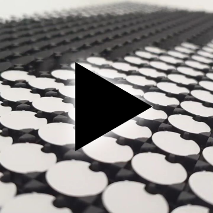

# FlipDots CastCanvas

This script will accept any image array buffer over WebSockets, desaturate & scale to B/W, convert to FlipDot data and push out over USB.

## What are FlipDot displays?

Flip-dots or Flip-disc, are made of small disks with a permanent magnetic that physically flip back and forth revealing one side or the other. Powered by a small electromagnetic to flip it retains its state even after power is disconnected. Click here if you’d like to [know more](https://flipdots.com/en/electromagnetic-flip-disc-technology-how-it-works/).

The AlfaZeta XY5 FlipDot display includes its own controller board that communicates over a RS485 serial connection using its own protocol. This repo simplifies connecting and streaming images to the FlipDot display.

## FlipDots in action

## Requirements
- [AlfaZeta](https://flipdots.com/) FlipDot display
- Power supply 24V 1A
- USB-to-RS485 adaptor 
- RJ11 cable / wire

## Quick start, I can't wait!
Flip pin 8 of the DIP switch on, connect power and enjoy demo mode.

## Wiring

See https://github.com/owenmcateer/FlipDots

## Communicating

Data is sent to the FlipDots over RS485 serial connection. Each byte of data sets 7 dots in a single column on/off. Running from bottom to top, left to right. See the example below.   

This Git repo script will accept any image array buffer over WebSockets, desaturate & scale to B/W, convert to FlipDot data and push out over USB.

To make this even easier you can use my [Canvas Cast](https://github.com/owenmcateer/canvas-cast) program to easily stream any HTML canvas over WebSockets to the FlipDot display.

**Usage**  
1) Run `npm install`
2) Run `node FlipDots.js` and find your USB-to-RS485 adaptor port address.
3) Open *FlipDots.js* and in config, enter this port address
4) Still in *FlipDops.js* edit your panel settings (size & IDs)
5) Again run `node FlipDots.js` and look for "Serial port opened and ready!"
6) Now stream image data from [Canvas Cast](https://github.com/owenmcateer/canvas-cast)
