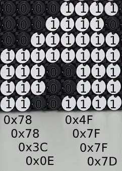

# FlipDots

FlipDot is a kinetic display I use for interactive art and animations. This repo contains all the information and code to set one up and get it connected to a computer.

This script will accept any image array buffer over WebSockets, desaturate & scale to B/W, convert to FlipDot data and push out over USB.

## What are FlipDot displays?

Flip-dots or Flip-disc, are made of small disks with a permanent magnetic that physically flip back and forth revealing one side or the other. Powered by a small electromagnetic to flip it retains its state even after power is disconnected. Click here if you’d like to [know more](https://flipdots.com/en/electromagnetic-flip-disc-technology-how-it-works/).

The AlfaZeta XY5 FlipDot display includes its own controller board that communicates over a RS485 serial connection using its own protocol. This repo simplifies connecting and streaming images to the FlipDot display.


## FlipDots in action
[](https://www.instagram.com/p/CCBpNmXCr6o/)

## Requirements
- [AlfaZeta](https://flipdots.com/) FlipDot display
- Power supply 24V 1A
- USB-to-RS485 adaptor 
- RJ11 cable / wire


## Quick start, I can't wait!
Flip pin 8 of the DIP switch on, connect power and enjoy demo mode.

## Wiring

Each 28x14 panel is made up of two 7x28 panels on one board, each with their controller we need to daisy chain together.  
**!SAFETY PRECAUTION!** If you don't know what you're doing, ask for help. 24V might not kill you but it will hurt and break your equipment.

### Step 1: DIP switch setup
Each controller has two DIP switches that need to be set. **3-pin Baud-rate** and **8-pin Address**


**Baud-rate (3-pin DIP)**  
Communication transfer rate is set as follows. For my setup I went with 19200 ↓↓↑ as I found 9600 too slow to handle 20fps.
```
Value | ON  | Speed
------|-----|--------
  0   | ↓↓↓ | N/A
  1   | ↑↓↓ | N/A
  2   | ↓↑↓ | N/A
  3   | ↑↑↓ | 9600
  4   | ↓↓↑ | 19200
  5   | ↑↓↑ | 38400
  6   | ↓↑↑ | 57600
  7   | ↑↑↑ | 9600
------|-----|--------
      | OFF |
```

**Address (8-pin DIP)**  
This is the address ID used when pushing out the image data, each panel listens for its data.
```
Pins | Description
-----|--------------
 0-5 | Address in binary code (natural)
  6  | Magnetising time: OFF: 500μs(default), ON: 450μs
  7  | Test mode: ON/OFF. OFF = normal operation
-----|--------------
```
*Note: Reducing the magnetising time to 450μs will flip the dots faster but runs the risk of them not flipping at all.*

**My settings:**
```
↓↓↑ | ↑↓↓↓↓↓↓↓ = Baud:19200 | ID: 1
↓↓↑ | ↓↑↓↓↓↓↓↓ = Baud:19200 | ID: 2
```

### Step 2: Wiring

**Power**  
Get a decent 24V DC power supply with at least 1A for a 28x14 display. See controller diagram above to connect VCC/GND.

**Serial data**  
Plug a RJ11 cable into J1(IN) / J2(OUT).  
Or if like me you don't have a RJ11 cable, twist two wires together and connect to the **J3** screw terminals.

The other end of the serial data cable will connect to your USB-to-RS485 adaptor and then into your computer.

## Communicating

Data is sent to the FlipDots over RS485 serial connection. Each byte of data sets 7 dots in a single column on/off. Running from bottom to top, left to right. See the example below.   


This Git repo script will accept any image array buffer over WebSockets, desaturate & scale to B/W, convert to FlipDot data and push out over USB.

To make this even easier you can use my [Canvas Cast](https://github.com/owenmcateer/canvas-cast) program to easily stream any HTML canvas over WebSockets to the FlipDot display.

**Usage**  
1) Run `npm install`
2) Run `node FlipDots.js` and find your USB-to-RS485 adaptor port address.
3) Open *FlipDots.js* and in config, enter this port address
4) Still in *FlipDops.js* edit your panel settings (size & IDs)
5) Again run `node FlipDots.js` and look for "Serial port opened and ready!"
6) Now stream image data from [Canvas Cast](https://github.com/owenmcateer/canvas-cast)
