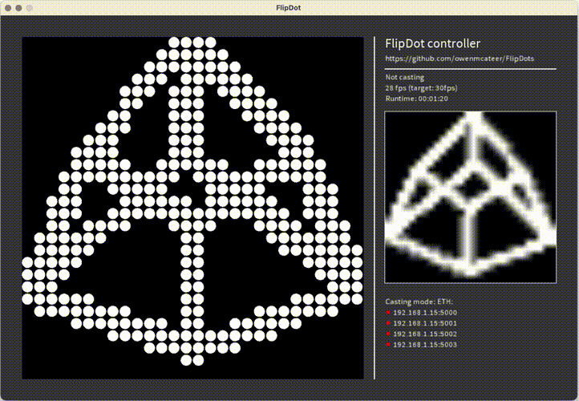
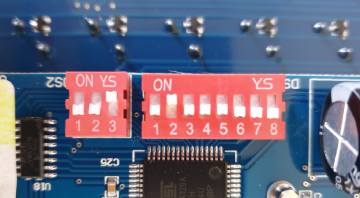

# FlipDot display

This repo contains a [Processing](https://processing.org/) sketch to control FlipDot panels from [AlfaZeta](https://flipdots.com). It uses a virtual display you can draw and animate on that then gets cast to your FlipDot display panels.

*Note:* if you don't have a FlipDot display you can still use this software as a FlipDot simulator.

- For the JavaScript version see [CastCanvas](./CastCanvas/)
- For the FlipDigit library [see this repo](https://github.com/owenmcateer/FlipDigits)

https://user-images.githubusercontent.com/1763300/214524873-d32401c9-916a-4d84-ae42-95b464082fdb.mp4

## What are FlipDot displays?

Flip-dots or Flip-disc, are made of small disks with a permanent magnetic that physically flip back and forth revealing one side or the other. Powered by a small electromagnetic to flip it retains its state even after power is disconnected. Click here if you’d like to [know more](https://flipdots.com/en/electromagnetic-flip-disc-technology-how-it-works/).

The AlfaZeta XY5 FlipDot display includes its own controller board that communicates over a RS485 serial connection using its own protocol. This repo simplifies connecting and streaming images to the FlipDot display.

## Hardware requirements

*Remember if you don't have a FlipDot display you can still use this software as a FlipDot simulator.*

- FlipDot panel from [AlfaZeta](https://flipdots.com)
- 24V PSU (1A per panel)
- RS285 converter
- - ETH: [ETH-UKW485SR140](https://www.sklep.uk-system.pl/konwertery-eth-ukw485sr140-z-4-portami-szeregowymi-rs485-p-41.html) (best for high framerates)
- - ETH: [Waveshare](https://www.waveshare.com/product/iot-communication/wired-comm-converter/ethernet-to-rs232-rs485.htm)
- - ETH: [PUSR](https://www.pusr.com/products/serial-to-ethernet-converters.html)
- - USB RS485 [Amazon](https://www.amazon.com/DZS-Elec-Converter-Communication-Centralized/dp/B07CMY1DGK/), [Aliexpress](https://www.aliexpress.us/item/3256802833469866.html)
- Software: [Processing 4](https://processing.org/download)

## Setup

Each 28x14 panel is made up of two 7x28 panels on one board, each with their controller we need to daisy chain together.  
**!SAFETY PRECAUTION!** If you don't know what you're doing, ask for help. 24V might not kill you but it will hurt and break your equipment.

### 1) Wiring  

- Connect 24V power supply to the 24V DC in screw terminals
- Connect RS485 +/- with a JR11 plug or the screw terminals

### 2) DIP switches

Each controller has two DIP switches that need to be set. **3-pin Baud-rate** and **8-pin Panel address**

#### Baud-rate (3-pin DIP)

Communication transfer rate is set as follows. For my setup I went with the fastest value of 57600 ↓↑↑ as I found 9600 too slow to handle 20fps.

| Value | ON  | Baud rate|
|------|-----|--------|
|  0   | ↓↓↓ | N/A|
|  1   | ↑↓↓ | N/A|
|  2   | ↓↑↓ | N/A|
|  3   | ↑↑↓ | 9600|
|  4   | ↓↓↑ | 19200|
|  5   | ↑↓↑ | 38400|
|  6   | ↓↑↑ | 57600|
|  7   | ↑↑↑ | 9600|
|      | OFF ||

#### Address (8-pin DIP)

This is the address ID used when pushing out the image data, each panel listens for its data.

| Pins | Description|
|-----|--------------|
| 0-5 | Address in binary code (natural)|
|  6  | Magnetising time: OFF: 500μs(default), ON: 450μs|
|  7  | Test mode: ON/OFF. OFF = normal operation|

*Note: Reducing the magnetising time to 450μs will flip the dots faster but runs the risk of them not flipping at all.*

### 3) Serial data

To send frame data from your computer to the display you can do so over ETH or USB. For small displays USB is fine but larger displays will require an ETH solution.  
See suggested serial products above.

#### ETH convertor

**PC > ETH > ETH-RS485 convertor > FlipDot panels**

For an ETH solution set the following settings in [config.pde](./FlipDot/config.pde)  
Set `castOver` to `1`  
List all ETH convertor IP addresses and port numbers in `netAdapters`

#### USB convertor

**PC > USB-RS485 convertor > FlipDot panels**

For an USB solution set the following settings in [config.pde](./FlipDot/config.pde)  
Set `castOver` to `2`  
List all USB convertor COMs port address and baud rate `serialAdapters`

### 4) Processing

Install [Processing 4](https://processing.org/download) for your system and launch [FlipDot/FlipDot.pde](./FlipDot/FlipDot.pde)

**[config.pde](./FlipDot/config.pde)**  
Make sure you have set your convertor type as shown above. 

Set `config_cast` to `true` to cast data.

Next set the FlipDot panels and display settings [config.pde](./FlipDot/config.pde). For a Single 28x14 panel you can leave config.pde as it is.  
Add a config line for each FlipDot panel you have:  
`panels[0] = new Panel(0, 1, 0, 0);`
1) Adapter ID (see net/serialAdapters)
2) Panel ID (set on the 3-pin DIP switch)
3) X-position in total display
4) Y-position in total display

Finally set the number of panels you have in the following line: `Panel[] panels = new Panel[2];`

See [config.pde](./FlipDot/config.pde) for more examples and layouts.

### 5) Coding animations

Now you can draw and animate whatever you want! Everything gets drawn to `virtualDisplay`, I recommend looking at [example_anim.pde](./FlipDot/example_anim.pde) and [example_blips.pde](./FlipDot/example_blips.pde) for some examples of coding animations.

Don't forget to share your creations with me @motus_art on [IG](https://instagram.com/motus_art)/[TW](https://twitter.com/motus_art)

https://user-images.githubusercontent.com/1763300/214339655-2efb0460-cefd-432a-bd86-d43668057a87.mp4

## Games

Any pixel based game will work great on these displays.  While not quite Doom in this resolution, think Snake, Tetris and Pong.

### Tetris

A fully playable Tetris game on a FlipDot display. You can find the code here: [games_tetris.pde](./FlipDot/games_tetris.pde)  

https://user-images.githubusercontent.com/1763300/220141220-da981003-57d3-4386-afc8-1956685caede.mp4

